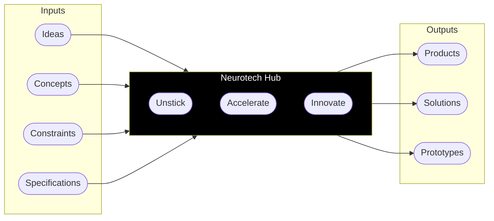

# 🧠 Neurotech Hub @ WashU

The Neurotech Hub at Washington University in St. Louis accelerates progress in neuroscience by providing cutting-edge technical services on demand. We **seek**, **test**, and **deploy** paradigm-shifting or bespoke technologies.

## 🤝 Work With Us

Interested in creating equipment, implementing new technology, or bringing your ideas to life? We can help!

1. **Membership**: Find a plan that fits or work with us on an hourly basis
2. **Training**: Get familiar with our equipment and safety protocols
3. **Schedule**: Book time with our equipment and expertise

## 📍 Find Us

Department of Neuroscience  
4370 Duncan Ave, Room 2115  
St. Louis, MO 63110

## 🔗 Links
- [Neurotech HubWebsite](https://neurotechhub.wustl.edu/)
- [Submit a Project](https://neurotechhub.wustl.edu/contact/submit-a-project)
- [Request Training](https://neurotechhub.wustl.edu/contact/request-training)
